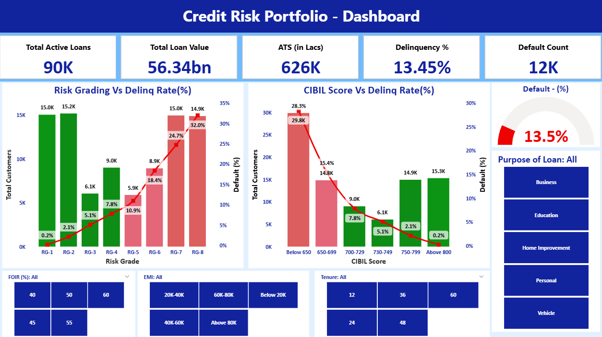

# 📊 Credit Risk & Portfolio Dashboard (Power BI)

## 🔍 Overview

This project showcases an interactive **Power BI dashboard** designed to analyze credit portfolio performance, lending trends, and risk indicators.
It provides actionable insights for business stakeholders to monitor loan performance, identify high-risk segments, and support data-driven decision-making.

---

## 🚀 Key Features

* 📈 Loan Portfolio Analysis (Disbursement, Outstanding, Collections)
* ⚠️ Risk Metrics Tracking (Delinquency, NPA, Default Trends)
* 👥 Customer Segmentation & Behavior Analysis
* 📊 KPI Monitoring (Growth, Performance, Efficiency)
* 🔄 Automated Data Refresh & Transformation
* 📉 Trend Analysis with Drill-down capabilities

---

## 🛠️ Tools & Technologies

* **Power BI**
* DAX (Data Analysis Expressions)
* SQL (Data Extraction & Transformation)
* Power Query (ETL)
* Excel / CSV Data Sources
---

## 📊 Dashboard Highlights

* Visual representation of loan portfolio performance
* Identification of high-risk customer segments
* Monitoring of overdue and delinquent accounts
* Business insights for improving lending strategies

---

## 📸 Sample Screenshots

---

## ⚙️ How to Use

1. Download the `.pbix` file from this repository
2. Open it using Power BI Desktop
3. Explore the dashboard using filters and slicers

---

## 💡 Business Use Case

This dashboard can be used by:

* NBFCs & Financial Institutions
* Risk & Credit Analysts
* Business & Strategy Teams

To:

* Monitor portfolio health
* Reduce credit risk
* Improve decision-making

---
## 📌 About Me
Data Analyst with experience in NBFC domain, specializing in:
- Credit Risk Analysis
- KPI Dashboarding
- Fraud Detection

📫 Connect with me:
- LinkedIn: https://www.linkedin.com/in/iyyappathiraviyam-1470b52aa/
- GitHub: https://github.com/Iyyappathiraviyam
